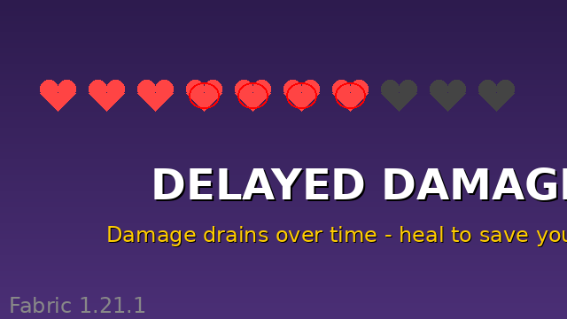

# Delayed Damage

A Minecraft Fabric mod that transforms combat by making all damage apply over time instead of instantly.



## Overview

When you take damage in Minecraft with this mod installed, the damage doesn't reduce your health immediately. Instead, it enters a "pending damage" pool that drains your health gradually over 3 seconds. This creates a window of opportunity where healing items and food can counteract incoming damage, allowing for clutch saves in intense combat situations.

## Features

- **Delayed Damage Application**: All damage drains HP slowly over 3 seconds instead of being applied instantly
- **Pending Damage Display**: The action bar shows how much damage is still pending
- **Healing Counteraction**: Using healing items or food during the damage drain period will reduce the pending damage
- **Damage Stacking**: Multiple hits stack their damage, extending the drain duration
- **Strategic Combat**: Adds a new layer of depth to combat timing and resource management

## How It Works

1. **Taking Damage**: When you're hit, instead of losing health immediately, the damage is added to your "pending damage" pool
2. **Drain Period**: Over the next 3 seconds, this pending damage gradually reduces your health
3. **Healing Window**: During this drain period, any healing you receive will first counteract the pending damage
4. **Stacking**: If you take multiple hits, the damage stacks and the drain period extends (up to 6 seconds max)

## Mechanics Details

- Damage drains in small increments every few ticks for smooth health reduction
- Certain damage types bypass the delay system: void damage, starvation, and instant kill commands
- When healing counteracts pending damage, you'll see a notification showing how much damage was negated
- If pending damage would kill you, the death is triggered properly

## Requirements

- Minecraft 1.21.1
- Fabric Loader 0.16.0+
- Fabric API 0.116.10+1.21.1

## Installation

1. Install Fabric Loader for Minecraft 1.21.1
2. Download and install Fabric API
3. Download `delayed-damage-1.0.0.jar` from the releases
4. Place the JAR file in your `mods` folder
5. Launch Minecraft with the Fabric profile

## Building from Source

```bash
git clone https://github.com/Simplifine-gamedev/delayed-damage.git
cd delayed-damage
./gradlew build
```

The compiled JAR will be in `build/libs/`

## Gameplay Tips

- **Plan Your Healing**: Since healing now counteracts pending damage, save your golden apples and potions for when you're taking heavy damage
- **Combat Timing**: You can survive otherwise lethal hits if you can heal quickly enough during the drain period
- **Multiple Opponents**: Fighting multiple enemies is more manageable since stacked damage gives you time to react
- **PvP Strategy**: In player combat, quick successive attacks are less instantly lethal, creating more tactical fights

## Compatibility

This mod should be compatible with most other Fabric mods. It uses Fabric's damage event system and mixins to intercept healing, so mods that heavily modify damage or healing mechanics may have interactions.

## License

This project is open source. Feel free to use, modify, and distribute.

## Credits

Created by ali77sina
